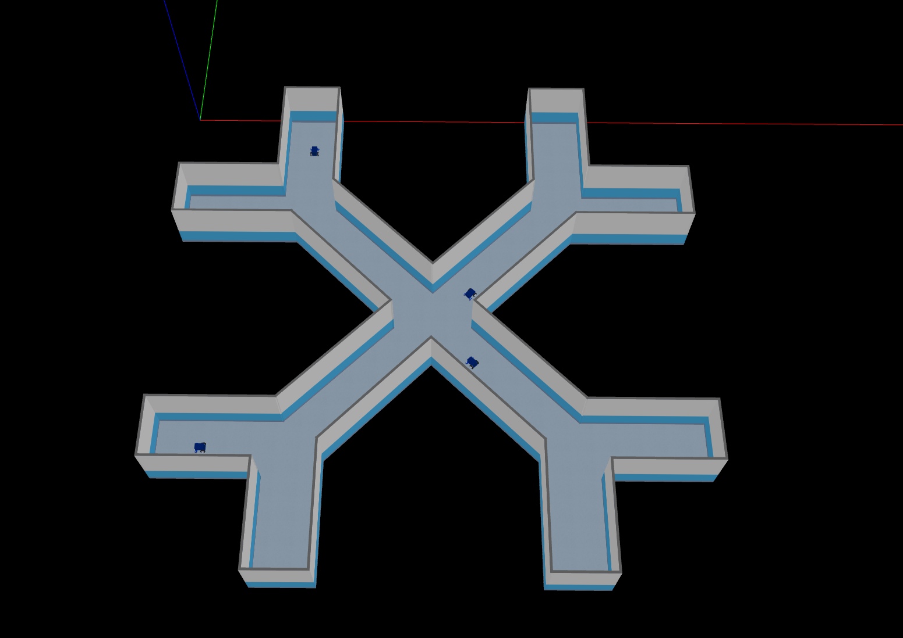

# Standalone Tests
1. [Introduction](#introduction)
3. [Summary of Test Results](#summary)

## Introduction 
To stress test the RMF scheduler the [demo Battle Royale](https://github.com/open-rmf/rmf_demos/#battle-royale-scenario) scenario was used.

The battle royale demo includes an X crossing with four robots that are told to loop between two opposite points, requiring each robot to share a corridor with another robot and the junction with three other robots.

## Summary of Test Results 

The test was left to run overnight and throughout the project some stability issues leading to robot deadlocks were identified. In-depth debugging and updates to the scheduler were pushed as part of this deployment that increased the reliability until overnight stress tests were successful. The changes introduced can be seen in the [rmf_internal_msgs](https://github.com/open-rmf/rmf_internal_msgs/pull/45), [rmf_ros2](https://github.com/open-rmf/rmf_ros2/pull/228), [rmf_traffic](https://github.com/open-rmf/rmf_traffic/pull/86) and [rmf_demos](https://github.com/open-rmf/rmf_demos/pull/157) pull requests.

can we add a description of the pull requests. The people reading this are not technical and will be unable to go and see the pull requests